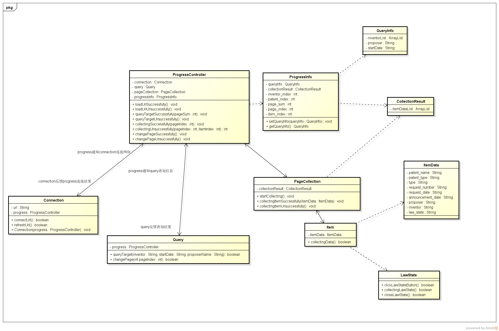

# PatentCrawler

专利爬虫
### 特别注意
工程使用了PhantomJs浏览器，用户需自行下载并放到res目录下
### 简单介绍

csdn博客：[http://blog.csdn.net/will4906/article/details/68955619](http://blog.csdn.net/will4906/article/details/68955619)

### 设计

1. 
2. 运用中介者模式设计对进程的控制，一旦进程有断开的地方，可以马上响应对连接的重新处理
