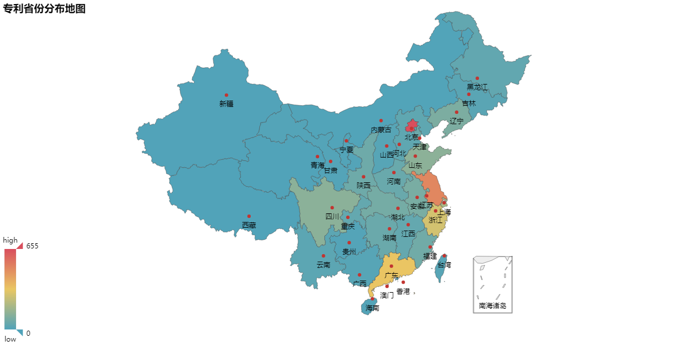
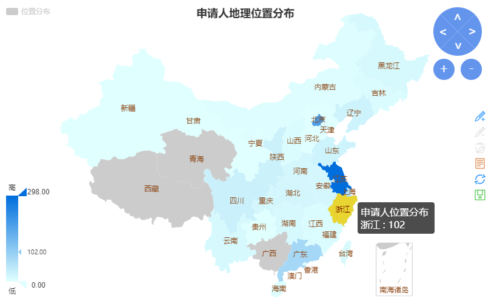

# PatentCrawler

专利爬虫

# 使用说明见[WIKI](https://github.com/will4906/PatentCrawler/wiki)

### Config

* 配置文件在config/config.ini
* 至少需要填写username和password

### Environment

* pip install -r requirements.txt
* 验证码采用k近邻算法进行识别，具体方法见[https://github.com/will4906/CaptchaRecognition](https://github.com/will4906/CaptchaRecognition)
* 代理模块使用: [https://github.com/jhao104/proxy_pool](https://github.com/jhao104/proxy_pool)

### Data Visualization





### License

PatentCrawler is released under the Apache 2.0 license.
```
Copyright 2017 willshuhua.me.

Licensed under the Apache License, Version 2.0 (the "License");
you may not use this file except in compliance with the License.
You may obtain a copy of the License at

    http://www.apache.org/licenses/LICENSE-2.0

Unless required by applicable law or agreed to in writing, software
distributed under the License is distributed on an "AS IS" BASIS,
WITHOUT WARRANTIES OR CONDITIONS OF ANY KIND, either express or implied.
See the License for the specific language governing permissions and
limitations under the License.
```
### 感谢支持

<table width="100%">
<tr><td align="center" colspan="2">赞赏</td></tr>
    <tr>
        <td align="center">
        
        </td>
        <td align="center">
        
        </td>
    </tr>
    <tr>
    <td align="center">微信</td>
    <td align="center">支付宝</td>
    </tr>
</table>